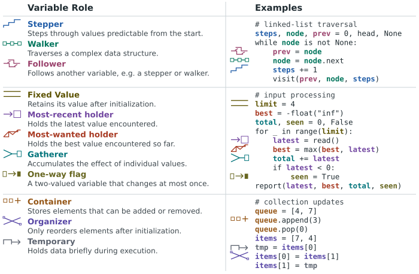

# Sajaniemi variable extractor

This repository extracts **Sajaniemi variable roles** from source code using [Joern](https://joern.io/) code property graphs. It currently supports C, C++, JavaScript, Python, and Ruby.

The extractor was originally developed for research on the interpretability of language models for source code. The associated work has been submitted and is not yet published. Although this repository originates from that research, it is maintained as a standalone tool and can be used independently for other source-code analysis tasks.

## Variable roles

Sajaniemi's variable roles characterize variables according to how their values are created, updated, and used during program execution. For example, a *stepper* moves through a predictable sequence, a *gatherer* accumulates contributions, and a *most-wanted holder* keeps the best candidate seen so far.

The extractor implements static contracts for eleven such roles. Variables for which none of these contracts can establish a role remain unlabelled.



The taxonomy is based on the following work by Sajaniemi and collaborators:

- Jorma Sajaniemi. “Visualizing Roles of Variables to Novice Programmers.” *Proceedings of the 14th Annual Workshop of the Psychology of Programming Interest Group*, pp. 111–127, 2002. [Paper](https://ppig.org/files/2002-PPIG-14th-sajaniemi.pdf).
- Jorma Sajaniemi and Raquel Navarro Prieto. “Roles of Variables in Experts’ Programming Knowledge.” *Proceedings of the 17th Annual Workshop of the Psychology of Programming Interest Group*, pp. 145–159, 2005. [Paper](https://ppig.org/files/2005-PPIG-17th-sajaniemi.pdf).

## Installation

Use Python **3.10 or newer**. Install [Joern 4.0.550](https://github.com/joernio/joern/releases/tag/v4.0.550) separately from its `joern-cli.zip` asset, and add the directory containing `joern` and `joern-parse` to `PATH`. The extractor calls both executables directly.

With pip, from this checkout:

```bash
python3 -m venv .venv
source .venv/bin/activate
python -m pip install -r requirements.txt
python -m pip install -e . --no-deps
sajaniemi-variable-extractor --help
```

The second installation step exposes the CLI and keeps local code edits immediately available. For an optional uv workflow, use:

```bash
uv sync
uv run sajaniemi-variable-extractor --help
```

For the extraction commands below, prefix `sajaniemi-variable-extractor` with `uv run` when using uv.

Check the external Joern launchers before running an extraction:

```bash
command -v joern
command -v joern-parse
```

On Windows, activate the virtual environment with its platform-specific activation script. The bundled Scala script is loaded from this checkout when present.

## First extraction

Run from the repository root to use the included Python fixture:

```bash
sajaniemi-variable-extractor run \
  --source tests/fixtures/code/Python \
  --output-dir outputs/example
```

`--source` is a directory containing source files (nested files are accepted), not an individual file. The CLI detects the language for a single tree. Its default `--layout auto` also accepts a directory of repositories or named splits; use `--layout single`, `repos`, or `splits` if the nesting is ambiguous. For a single tree, `--language Python` can check the detected language. The command writes `roles.json`, `roles.jsonl`, `variable_facts.json`, `legacy.json`, `pre.json`, and a reusable graph under `outputs/example/graphs/`. Existing graphs are reused; pass `--force` after changing source files.

For separate parsing and extraction, use the same source tree with the resulting graph:

```bash
sajaniemi-variable-extractor parse \
  --source tests/fixtures/code/Python --language Python \
  --output outputs/manual/python.bin
sajaniemi-variable-extractor extract \
  --graph-dir outputs/manual --source tests/fixtures/code/Python \
  --output-dir outputs/manual-results
```

See the [CLI reference](docs/cli.md) for every command, input layout, argument, and output file, and [contract documentation](docs/contracts.md) for the classification rules.

## Use cases

- **Computer science education:** study how variables play semantic roles or create teaching examples.
- **Code deobfuscation and variable renaming:** use inferred roles as clues when reading or renaming poorly named variables.
- **LLM interpretability:** examine representations of variable behavior in code models.
- **Machine-learning datasets:** generate source-linked role labels for code-semantics datasets.

These are possible applications of static annotations, not claims of accuracy for a particular corpus.

## Limitations

The ratings below are qualitative assessments of the current extractor, not measured corpus-wide precision or recall. Coverage depends on the source pattern and language.

| Role | Current extraction quality | Known limitation |
| --- | --- | --- |
| One-way flag | Excellent | — |
| Stepper | Excellent | — |
| Walker | Excellent | — |
| Most-wanted holder | Excellent | — |
| Gatherer | Good | — |
| Follower | Good | Strict matching favors precision, but can miss valid followers. |
| Most-recent holder | Average | Class-member holders are harder to identify from static evidence. |
| Fixed value | Average | The current rules can be too permissive in some contexts. |
| Temporary | Average | The current rules can be too permissive. |
| Organizer | Partial | Element immutability within a collection is difficult to establish from a static CPG. Detection currently relies on simple patterns or a recognized permutation without observed element mutation. |
| Container | Partial | Some organizers may be misclassified as containers. |

These rules operationalize Sajaniemi's roles; they are not a formal expression of the roles and do not establish semantic ground truth. The extractor deliberately relies on static CPG analysis rather than building or executing each project. As a result, some program behaviors cannot be recovered perfectly, and Joern's representation can occasionally be incomplete or imprecise when analyzing source code without the full build and runtime context. This trade-off is intentional: using Joern makes it possible to apply the same extraction pipeline across several programming languages, without requiring projects to be executable, while remaining practical for large collections of source code.

## Authors

- Célian Vasson
- Benjamin Heinzerling

## License

The repository is distributed under the [MIT License](LICENSE).
